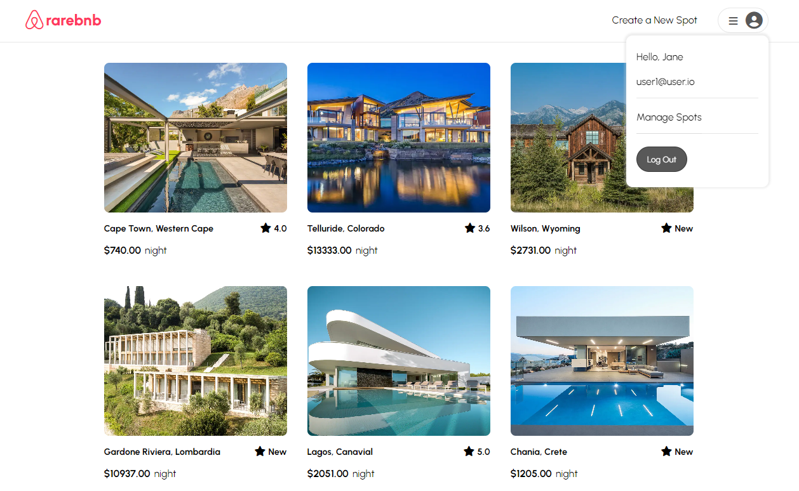
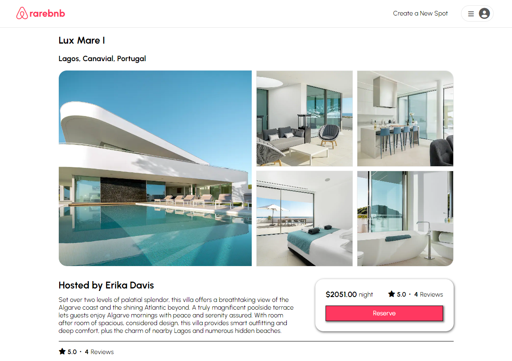
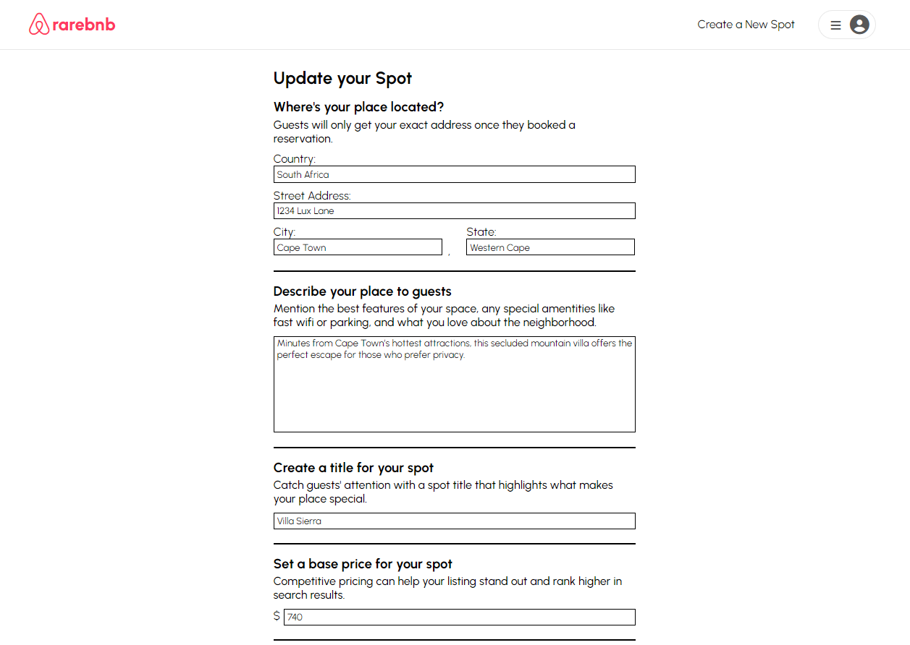

# API-project - AirBnb clone

## Hello, thanks for checking out my project!

This is my first fullstack web application created as an App Academy student. The project is a clone of AirBnb and uses Express, Sequelize and PostgreSQL for the backend structure. The front end was created using React and Redux along with vanilla CSS to style the page. 

Currently the app has functionality to authenticate users and manage spots/reviews. My future plans are to add a bookings feature which is already integrated in the backend.

The site is currently live here: https://aa-api-project.onrender.com/. You can also clone the repo and run locally, npm dependencies need to be installed in both the frontend and backend before running the npm start script. The db will also need to be migrated and seeded using npx dotenv sequelize db:migrate and npx dotenv sequelize db:seed:all

## Frontend screenshots

